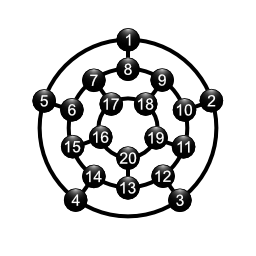

# EasyeMUD - EAsy SYsop Editing
 

EasyeMUD is an engine with a focus on making it easy to create content.

Inspired by [The Majic Realm](https://www.facebook.com/groups/868161636530458), and [open source][repo].

A new MUD engine being written in **Java**, and using **Lua** as the scripting language. Java is easy to role code in, write unit tests for, and is easy to debug locally *and* remotely.

[Lua] (pronounced LOO-ah) is an efficient, lightweight, embeddable scripting language. It supports procedural programming, object-oriented programming, functional programming, data-driven programming, and data description.

[lua]: https://www.lua.org
[repo]: https://github.com/abathur8bit/easyemud

# Status
Starting simple. Currently Plays Hunt the Wumpus. Each connection get's it's own instance of the game. No bats or pits implemented. That will come in future releases. 

# Hunt the Wumpus
The rules are simple. The map is made up of 20 caves, arranged like a dodecahedron. The player starts in cave 1, and the Wumpus is hidden somewhere in the map. Also in the map are a couple pits you can fall into, and bats that will pick the player up and randomly drop them into another cave. To win the game, the player will fire one of 5 bendy arrows and try to hit the Wumpus.

The caves are in complete darkness, so the player cannot see into adjacent caves; instead, when moving to a new empty cave, the game describes if they can smell a Wumpus, hear a bat, or feel a draft from a pit in one of the connected caves. Entering a cave with a pit ends the game due to the player falling in, while entering the cave with the Wumpus startles it; the Wumpus will either move to another cave or remain and kill the player.

Below is the map for Hunt the Wumpus:

# Build and run
First you will need to get the server built and running. Then you can use a telnet or MUD client to connect and play. 

## Server
You need to first install ssobjects. It's not available via the maven repository, so grab from github, and install via 

    git clone https://github.com/abathur8bit/ssobjects.git
    cd ssobjects/java
    mvn install 
    cd ../..

Next build EasyeMud and run with

    git clone https://github.com/abathur8bit/easyemud.git
    cd easyemud
    mvn package
    mvn exec:java
    
## Client
The server will be running on port 6660. 

    telnet localhost 6660

# Script Engine
Testing LUA for the script engine, and using LUAJ. 

# Reference
- [Programming in LUA](https://www.lua.org/pil/contents.html)
- [LUAJ Maven](https://mvnrepository.com/artifact/org.luaj/luaj-jse)
- [LUAJ Project](https://github.com/luaj/luaj)
- [LUAJ API docs](http://luaj.org/luaj/3.0/api/overview-summary.html)
- [Hunt the wumpus](https://en.wikipedia.org/wiki/Hunt_the_Wumpus)
- [Hunt the wumpus atari archive](https://www.atariarchives.org/bcc1/showpage.php?page=249)
- [Hunt the Wumpus game online](https://jayisgames.com/games/hunt-the-wumpus/)